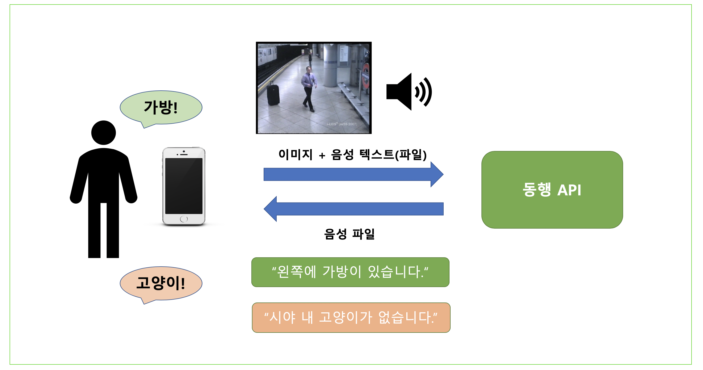

# Naver Hackaton Team 동행

### 서비스 소개

#### Info

- 물체 정보를 파악하여 사용자들에게 물체에 대한 정보를 제공해주는 서비스

#### Usage

- 사용자가 사진 촬영하여 서버로 전송되면 사진에 대한 객체 정보를 사용자에게 음성으로 알려준다.

### Development Environment

- Server
 - flask
 - http://49.50.166.13:5000/

- client 
 - react
 - http://49.50.166.223:3000/

- OS
 - ubuntu 16.04
 

