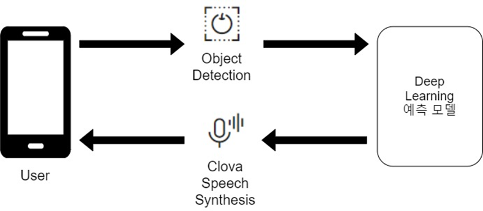
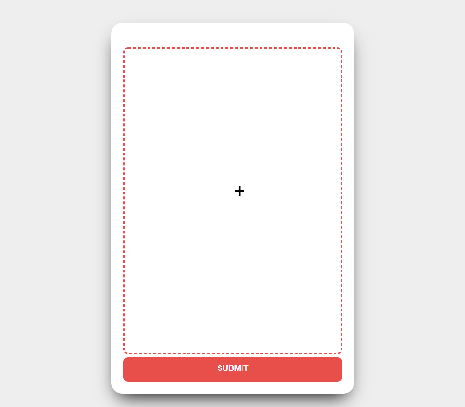
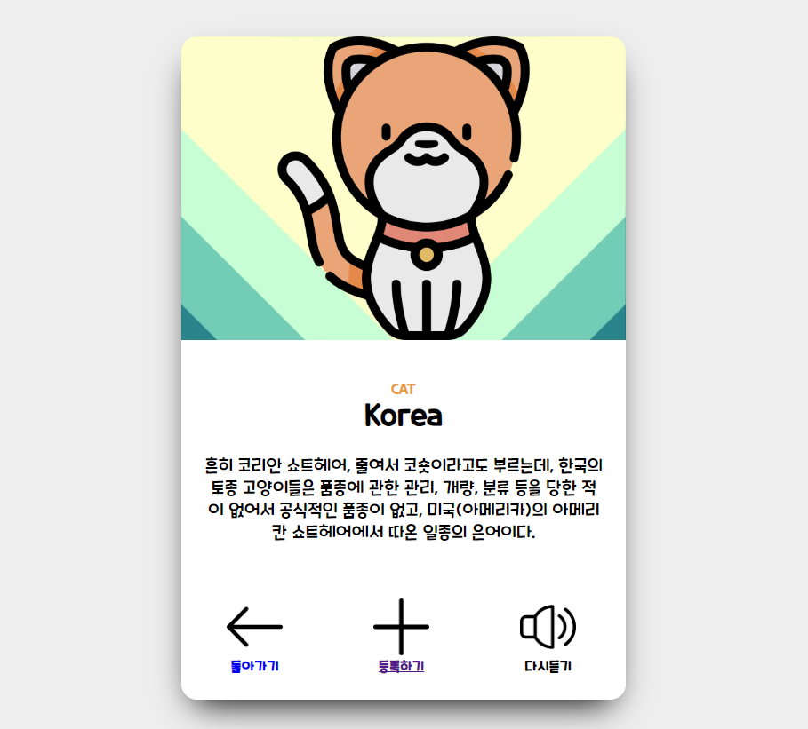
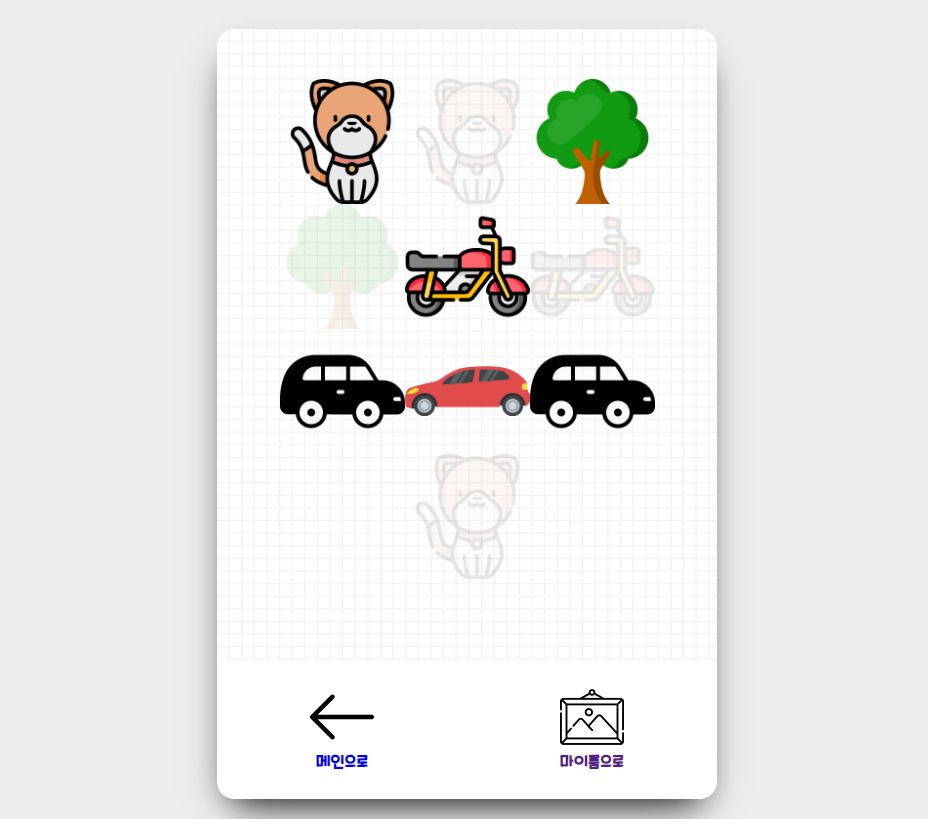
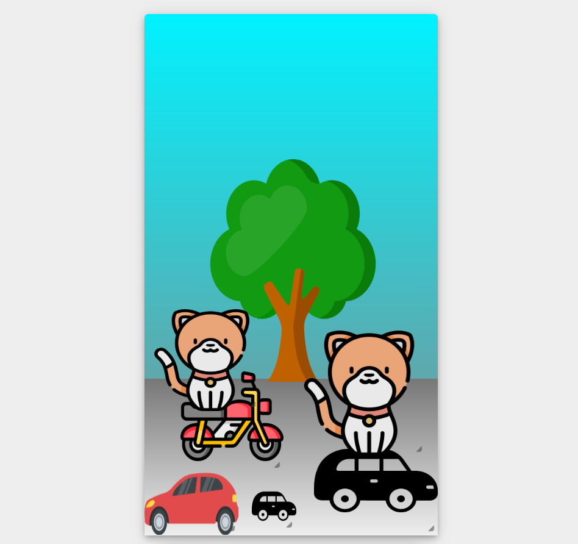
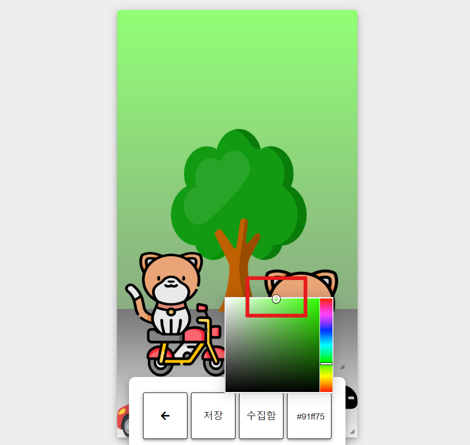

# 무엇이든 찍어주세요 만물도감

by NAVER-AI-BURNING-DAY

- 팀명 : NAIVER
- 팀원 : 황지민, 정용주, 전현진, 권윤옥

## 프로젝트 소개

'**무엇이든 찍어주세요 만물도감**'은 차량이나 식물 등의 사진을 찍어서 Naver AI service API의 **object detection**으로 대분류로 나온 값을 소분류를 나눈 뒤,  사진에 있는 사물에 대한 정보를 사용자에게 **Clova의 음성**으로 안내해줍니다. 그리고 이렇게 모은 수집함에서 Item들을 싸이월드의 **My room** 형식으로 꾸밀 수 있게 하였습니다.

서비스 사용 대상은 호기심이 왕성한 **어린이**들입니다. 지적 호기심 충족시킬 수 있는 서비스를 구축하여 학습에 도움을 줄 수 있다고 예상합니다. 알고 싶은 사물이 있을 때 사진을 촬영하면 음성으로 바로 안내해줄 수 있는 것이 저희가 구성한 서비스의 강점입니다.

## 작업환경

- Anaconda 4.8.0
- PYTHON 3.7
- pip requirments
- flask 1.0.2
- pymysql
- MySQL80

## WEB UI

**root page의 Intro**

서비스의 Title을 보여줍니다.

**root page**

사진을 찍어서 업로드 합니다.

**Waiting page**

사진을 분석하는동안 긴장감을 조성합니다.

**Prediction page**

사진에서 가장 정확도가 높은 물체의 소분류 또는 대분류의 Class label과 설명을 볼 수 있습니다. 또한 나의 저장소에 등록 할 수 있습니다.

**저장소 페이지**

자신이 등록한 Item들을 모두 볼 수 있습니다. 사진을 클릭하면 My room에서 보여줄지 숨길지 선택 할 수 있습니다.

**My room**

보여줄 ITEM들을 My room이라는 가상의 공간에서 Drag & resize하여 배치 할 수 있습니다.

**setting**

또한 배경색을 변경 할 수 있습니다.

