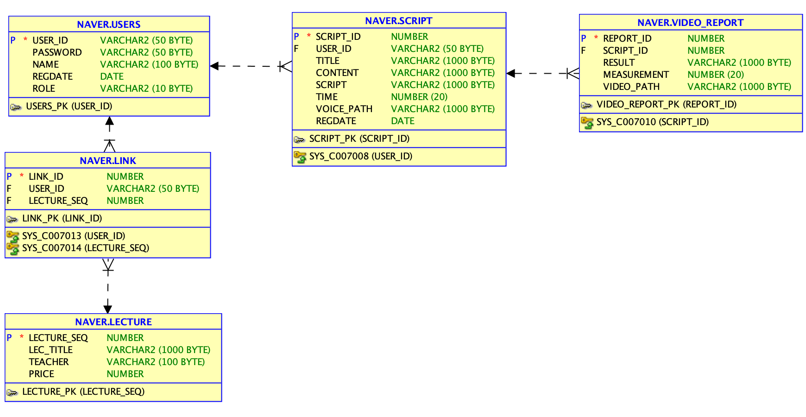

# DataBase

## 0. Schema




## 1. Initialization

```sql
 -- 계정 생성 
create user NAVER identified by 1234
default TABLESPACE mc;
-- 권한 부여
grant connect,resource,dba to NAVER;


DROP TABLE VIDEO_REPORT;
DROP TABLE SCRIPT;
DROP TABLE LINK;
DROP TABLE USERS;
DROP TABLE LECTURE;

CREATE TABLE USERS (
USER_ID VARCHAR2(50) PRIMARY KEY,
PASSWORD VARCHAR2(50),
NAME VARCHAR2(100),
REGDATE DATE,
    ROLE VARCHAR2(10) CHECK ( ROLE IN ('user', 'admin'))
);
INSERT INTO USERS VALUES('admin','1234','관리자',sysdate,'admin');
INSERT INTO USERS VALUES('test','1234','유미선',sysdate,'user');

CREATE TABLE SCRIPT (
SCRIPT_ID NUMBER PRIMARY KEY,
USER_ID VARCHAR2(50) REFERENCES USERS (USER_ID),
TITLE VARCHAR2 (1000),
CONTENT VARCHAR2 (1000),
SCRIPT VARCHAR2 (1000),
PTTIME NUMBER(20),
VOICE_PATH VARCHAR2(1000),
REGDATE DATE
);
INSERT INTO SCRIPT VALUES(0,'admin','관리자 전용','관리자 전용 관리양식입니다.',
'This is for admin',0,'0.wav',sysdate);
INSERT INTO SCRIPT VALUES(1,'test','20190301 교양발표','안녕하세요 저는 테스트입니다.',
'Hi, my name is test',1000,'smile.wav',sysdate);
insert into script
values( (SELECT nvl(MAX(script_id),0)+1 FROM script), 'test', '20190304 호주 AI 전문 대학원 특별 강연',
        '인공지능에 대하여 강연하겠습니다.','I will talk about artificial intelligence.', 3000, 'talk.mp3', sysdate);
        
insert into script
values( (SELECT nvl(MAX(script_id),0)+1 FROM script), 'test', '20200503 긴장되는 미국 Ted 강연 발표',
        '안녕하세요, 저는 발표자입니다. 반갑습니다.','Hello, I am a presenter. Nice to meet you.', 4000, 'hello.mp3', sysdate);

CREATE TABLE VIDEO_REPORT(
REPORT_ID NUMBER PRIMARY KEY,
SCRIPT_ID NUMBER REFERENCES SCRIPT (SCRIPT_ID),
RESULT VARCHAR2(1000),
MEASUREMENT NUMBER(20),
VIDEO_PATH VARCHAR2(1000)
);

INSERT INTO VIDEO_REPORT VALUES(0,0,'관리자 테스트','0','http://');
INSERT INTO VIDEO_REPORT VALUES(1,1,'표정이 편안해지셨군요.','9','http://');

CREATE TABLE LECTURE(
LECTURE_SEQ NUMBER PRIMARY KEY,
LEC_TITLE VARCHAR2(1000),
TEACHER VARCHAR2(100),
PRICE NUMBER
);
INSERT INTO LECTURE VALUES(1,'편안하게 말하는 스피킹 베이직','타미',20);
INSERT INTO LECTURE VALUES(2,'면접에서 떨지 않고 말하는 법 !','네이버클라우드플랫폼',30);

CREATE TABLE LINK(
LINK_ID NUMBER PRIMARY KEY,
USER_ID VARCHAR2(50) REFERENCES USERS (USER_ID),
LECTURE_SEQ NUMBER REFERENCES LECTURE (LECTURE_SEQ)
);
INSERT INTO LINK VALUES(1, 'test', 1);
INSERT INTO LINK VALUES(2, 'test', 2);

select *
from lecture
where lecture_seq in (select lecture_seq from LINK where user_id = 'test') ;

commit;
-- sequence
```

