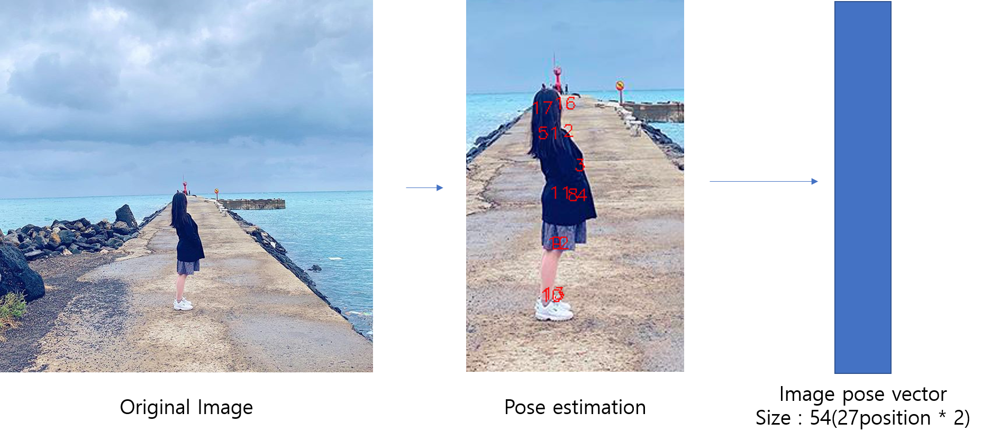
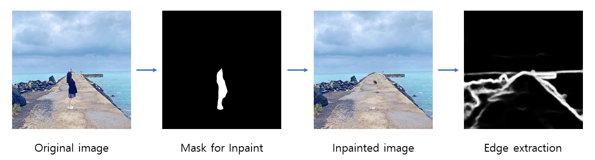

# 1. Data preparation

* Crawling
 인스타그램에서 여행, 인생샷 위주의 해시태그를 검색하여 나오는 사진들을 크롤링하였습니다. 이후 두 차례의 manual curation을 거쳐 사람이 1명만 있고 인스타그램 감성에 맞는 사진 총 3592장을 준비하였습니다. 준비한 사진 중 training에  2,704장, test에 588장을 이용하였습니다.

* Manual curation 기준
 1) 사람이 없거나 1명보다 많은 사진
 2) 사람과 배경이 구분이 잘 안 되는 사진
 3) 셀카
 4) 흐릿한 사진
 5) 사람이 사진 대부분의 영역을 차지하는 사진
 6) 감성이 맞지 않는 외국인 사진

* Pose estimation
 NAVER AI API의 pose estimation을 이용하여 1)에서 얻은 사진들에 존재하는 사람의 pose 정보를 얻었습니다.

# 2. Data preprocessing
* Masking
 Pre-trained DeepLab 모델을 이용하여 사진을 semantic segmentation 한 후, 사람으로 label 된 pixel들을 흰색, 나머지 pixel들을 검은색으로하여 mask를 생성하였습니다. Training 시간을 줄이기 위하여 원본 이미지를 256*256 사이즈로 줄여서 진행하였습니다.

* Inpaint
 2.1에서 얻은 사람 mask와 pre-trained DeepFill 모델을 이용하여 각 사진에서 사람을 지우고 주변 배경에 맞도록 지운 부분을 채워주었습니다. 즉, 사람이 없을 때의 배경 사진을 얻었습니다.

* Edge extraction
 2.2에서 얻은 배경 사진에서 pre-trained HED(Holistically-nested Edge Detection)를 이용하여 의미있는 edge들만 추출하여 흑백 사진을 얻었습니다. 
 
 
 
