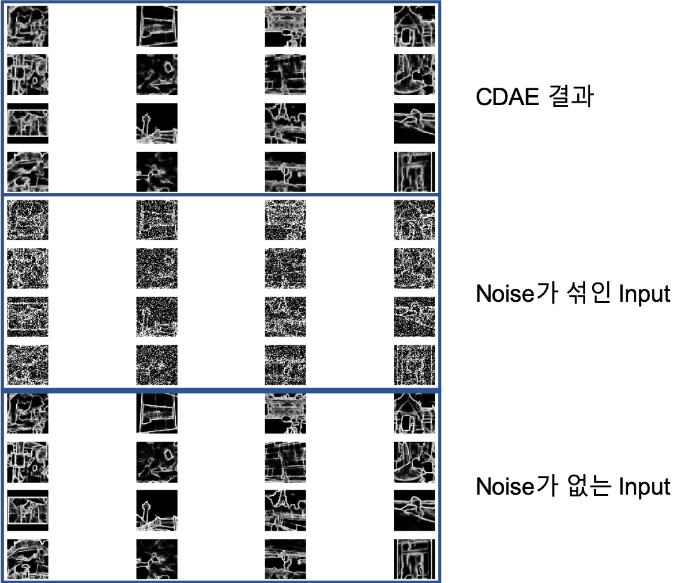
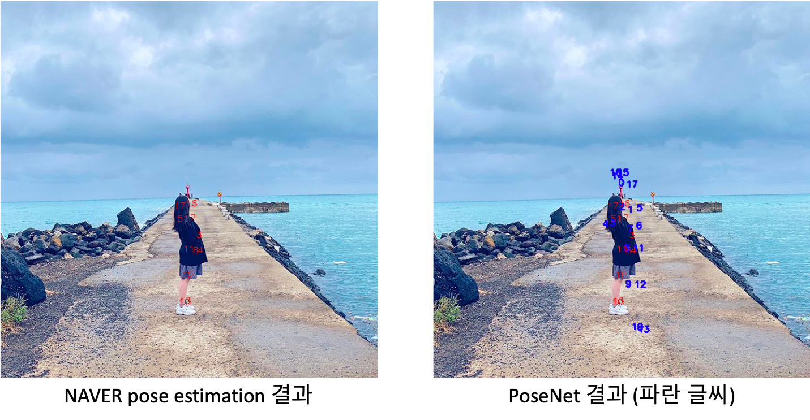

# 1. CDAE(Convolutional Denoising Auto-Encoder)
 CDAE는 noise가 낀 edge image로부터 noise가 없는 edge image를 재구축할 수 있는 latent vector를 제공하는 네트워크입니다.
 edge image에서 noise를 제거하면서 의미있는 정보만을 남긴 latent vector를 얻고자 했습니다.
 Input data로 2,646장의 edge image들을 사용했고, denoising을 위해서 모든 image에 임의의 noise를 섞었습니다.
 Edge image 재구축 결과는 아래와 같습니다.

# 2. PoseNet
 PoseNet은 CDAE에서 얻은 latent vector로부터 자세 정보를 예측을 해주는 네트워크입니다.
 PoseNet은 Fully connected Network로 latent vector를 input으로 받습니다.
 PoseNet의 학습은 latent vector의 원본 사진에 대한 NAVER pose estimation API에의 자세를 맞추는 방향으로 학습합니다.
 PoseNet의 학습은 2,646장의 사진 latent vector로 사전학습을 진행하고, 추가로 엄선한 579장의 latent vector로 심화 학습을 했습니다.
 PoseNet에서 얻은 자세 결과의 예시는 다음과 같습니다.

# 3, MaskNet
 MaskNet은 PoseNet에서 얻은 pose vector로부터 모델이 위치해야하는 위치를 예측해주는 네트워크입니다.
 MaskNet은 Convolutional neural Network로 VGG Net의 architecture를 기반으로 변형한 두 개의 model로 구성되어있습니다.
 MaskNet model1의 학습은 pose vector를 기반으로 만든 image가 원본 이미지의 ‘사람’ semantic segment를 복원하도록 합니다.
 MaskNet model2의 학습은 model1과 같으나 더 큰 image를 만든 후 maxpooling을 통해 원본 사진의 크기로 downsizing 하는 과정이 추가되어있습니다. 이 과정을 통해 model2는 mask의 지엽적 특징보다는 mask의 중심 위치를 중점적으로 학습하게됩니다.
 2,646장의 사진 latent vector로 사전학습을 진행하고, 579장의 test set에 대해 validation 했습니다. 학습 완료 후 각 모델은 test set에 대해 85%의 정확도와 0.18 이하의 Binary cross entropy loss를 나타냈습니다.
 MaskNet의 결과는 LSD의 최종 결과물이 됩니다.