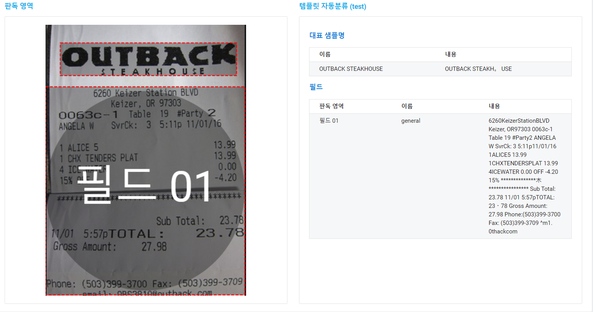
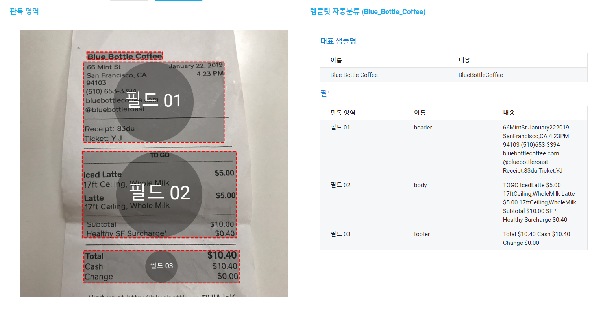
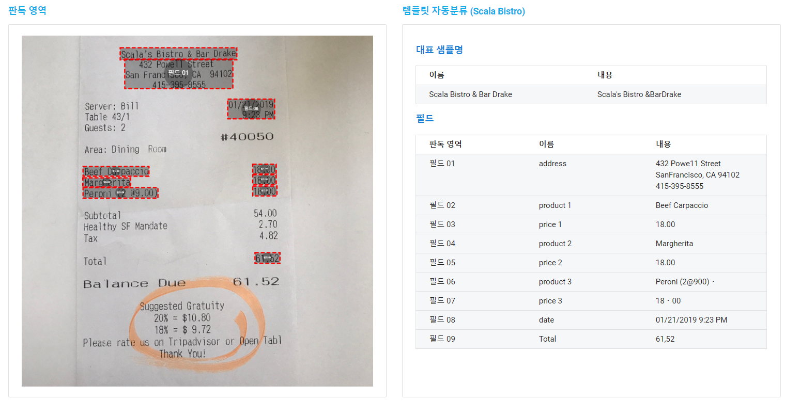
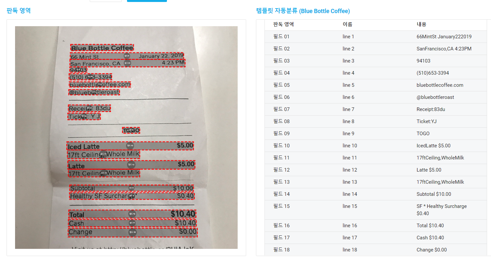
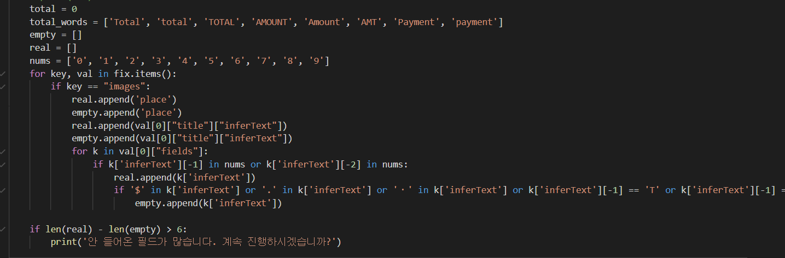
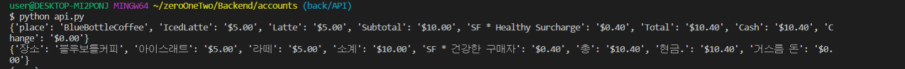

## (OCR API, Papago API )+ 환율 API

### 1. Naver OCR 호출

OCR API를 적용할 때에 가장 중요하게 고려한 것은 인식률과 Papago API 연동 시, 번역의 완성도였다. 

이를 고려하여 다양한 방법으로 진행해봤다. 우선은 기본으로 제공하는 General Text 추출을 시도해봤고, 꽤 뛰어난 인식률에 비해, 결과 값의 줄 구분이 안 되어있어, Papago API에서 번역 값이 잘 나오지 않았다.

또 다른 방법으로 영수증을 삼등분하여 header(보통 상호명과 주소, 전화번호 등 Information이 있는 구역), body(소비내역이 주로 적혀있다), footer(총 합계 및 다른 부가적인 계산 요소들이 적혀있다.)로 필드를 나누어 인식했으나, 이 또한 번역에서 원하는 결과 값을 얻지 못했다.

 정말 원하는 결과를 받고 싶으면, 추출하고 싶은 값이 있는 부분에만 구체적인 필드를 지정하여 OCR 요청하는 방법도 있었으나, 이를 할 경우, 등록되지 않은 템플릿을 돌릴 경우 전혀 다른 결과가 나올 수 있기 때문에 시도하다가 포기했다.

이러한 시행착오 끝에 정한 방법은 한 줄 단위로 필드를 지정하여 OCR에 요청하고 약간의 후 처리과정을 거쳐 나온 결과 값을 Papago API에 요청하는 것이었다.  이러한 방법을 쓴 이유는 대체적으로 한 줄 안에 소비제품 명과 가격이 다 나와있고, 한 줄을 단위로 내용이 종결되는 경우가 많기 때문이었다. 한 멘토님의 조언에 따르면, 이 방법은 실제로도 현업에서 쓰이고 있다고 하며 인식률과 번역 완성도를 고려했을 때, 가장 나은 방법이라고 평가하였다.

### 2. 결과 값 후 처리

한 줄을 단위로 인식된 텍스트 값이 나왔다. 모든 텍스트를 있는 그대로 저장할 수도 있지만, 우리 팀이 만드는 서비스 상, 상호명, 소비 내역, 총 합계가 중요하기에 다른 부가적인 요소들을 어떻게 효과적으로 걸러낼 지에 대해 고민했다.

여러 방법에 대해 고민했고 그 결과 완벽하지는 않지만, 80% 정도의 완성률을 보이는 알고리즘을 짤 수 있었다. (필드의 마지막 값은 실수여야 되고, 가격에는 '.' 이나 '$'가 들어가야되며, 총합을 나타내는 말이 안들어가면 일반소비로 분류하는 등 다양한 기준을 넣어 결과 값을 만들 어 줬다.) 이를 바탕으로 결국 품목(key)과 가격(value)로 구성 된 receipt라는 딕셔너리를 만들 수 있었다.

### 3. Papago에 번역 요청 및 후 처리

영어로 나타낸 receipt 딕셔너리의 key, value 값을 파파고에 요청하여 번역했다. 이를 각각 recepit_trans라는 한국어로 번역 된 딕셔너리에 저장했는데, 후 처리가 정말 중요했다. 예를 들어 영수증에 '거스름 돈'을 나타낼 때 영어 'Change'단어를 쓰는 경우가 많지만, 이를 파파고에 돌릴 경우 '바꾸다'라는 결과 값이 나온다. 이와 같이, 파파고에서 적절치 못한 번역을 하는 경우, 후 처리를 통해 적절한 말로 바꿔주었다.  결과는 꽤나 성공적인 결과 값이 나오는 경우가 많았다.

### 4. 추가로 환율API 불러오기

우리가 만드는 서비스는 한 영수증에 대한 소비 합계를 불러와야 하는 것은 물론, 해당 금액에 대한 환율을 적용하여 개인 소비 내역에 저장하고,  누적금액까지 구해 주는 기능을 갖고 있다. 이를 위해 수출입은행 환율 API를 이용했고, 이전에 Papago에서 'Total' 이나 '총'이라는 key 값을 가진 경우 해당 value에 환율을 곱하여 개인 소비 내역에 전송했다.